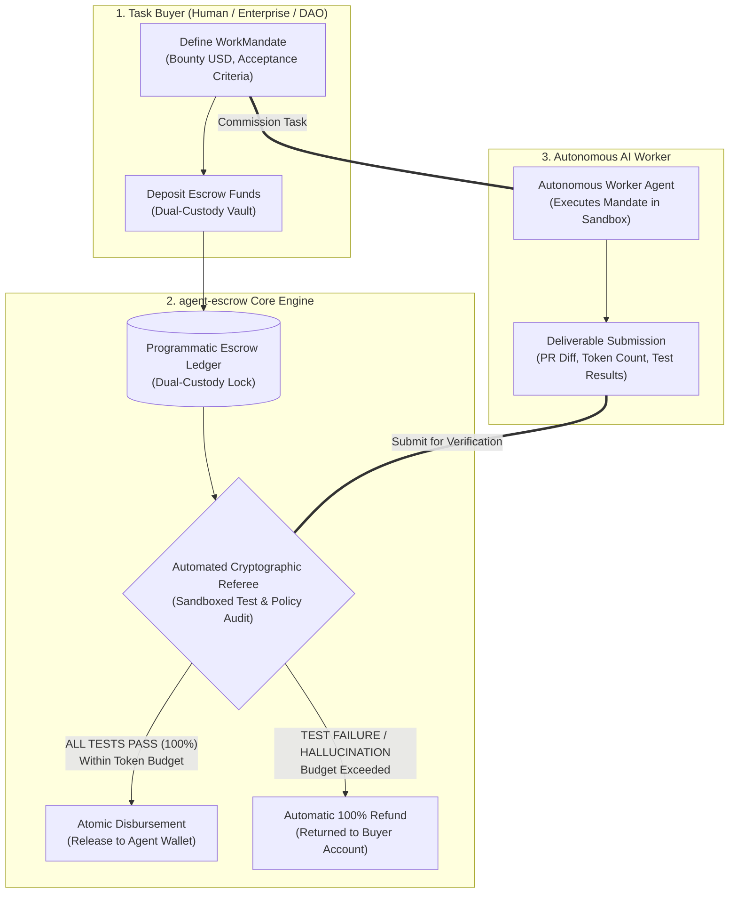
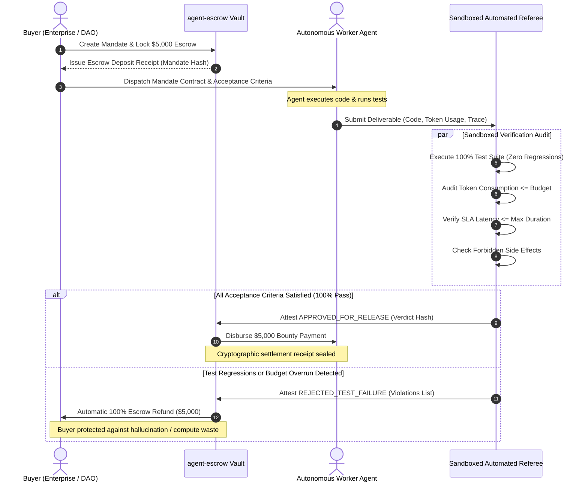
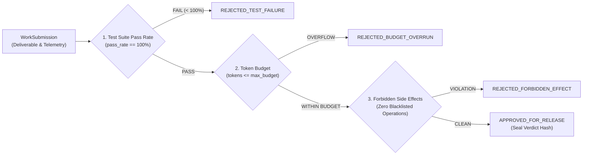

# 🤝 agent-escrow
> **Verifiable Work & Programmatic Escrow Settlement Protocol for Autonomous AI Labor**

[](LICENSE)
[]()
[]()
[]()

`agent-escrow` is a programmatic settlement protocol and referee engine designed for the emerging **Autonomous AI Agent Economy**. It allows buyers (humans, enterprises, or orchestrator swarms) to commission high-value tasks from AI agents with mathematical certainty: **bounty funds are held in dual-custody escrow and released if and only if the agent’s submission passes 100% of cryptographic test suites, token budget caps, and safety invariants.**

If an agent hallucinates, causes regressions, or burns excessive compute, the escrow automatically refunds 100% of the deposit back to the buyer.

---

## Why Agent Escrow?

As autonomous agents transition from conversational chatbots to commercial workers (writing code, generating database migrations, conducting security audits), the economic exchange model breaks down:
* **Pre-paying agents** exposes buyers to hallucinations, broken code, and unfinished jobs.
* **Post-paying agents** exposes autonomous workers to unpaid GPU compute and non-responsive counterparties.

`agent-escrow` introduces **Proof-of-Task Verification**: a neutral, automated sandboxed referee that verifies deliverables against formal contract criteria and executes atomic settlement without human intermediaries.

---

## System Architecture



---

## Protocol Lifecycle Sequence



---

## Proof-of-Task Acceptance Pipeline



---

## Quickstart & Simulation Demo

Run the built-in simulation contrasting a hallucinating agent (automatic refund) against a high-assurance verified agent (instant disbursement):

```bash
PYTHONPATH=projects python3 -m agent_escrow.cli demo
```

Output:
```text
================================================================================
🤝 AGENT ESCROW: PROGRAMMATIC SETTLEMENT PROTOCOL FOR AI LABOR
================================================================================

[Step 1] Creating Work Mandate: mandate-opt-sql-902
   Buyer: enterprise-fintech-corp
   Worker Agent: autonomous-dba-agent-4
   Bounty Amount: $5,000.00
   Mandate Contract Hash: 5f703792a4812a94d9887628a1546a69715abe634570ad8a71b909993999b2da

[Step 2] Programmatic Escrow Deposit:
   Locked Funds: $5,000.00 USD
   Vault Status: SECURED IN DUAL-CUSTODY VAULT

[Step 3] Simulation Scenario A: Hallucinating / Regressed Agent Submission
   Referee Status: REJECTED_TEST_FAILURE
   Violations Detected: ['Test pass rate failure: 83.3% < 100.0% required', 'Token budget exceeded: 9400 > 8000 limit']
   ⚡ Settlement Action: REFUNDED_TO_BUYER
   Amount: $5,000.00 USD refunded to enterprise-fintech-corp
   Receipt Hash: a66ceae2b3740a4243d0eb3d55df5233e005b1e693e289be291fb4e3f2e6bf0c

--------------------------------------------------------------------------------
[Step 4] Simulation Scenario B: High-Assurance Verified Agent Submission
   Referee Status: APPROVED_FOR_RELEASE
   Test Pass Rate: 100.0% (12/12 Passing)
   Tokens Consumed: 4,120 / 8,000
   Cryptographic Verdict Hash: 4e04d94d351703395686cc5670444cf99d730c6b6e4a490f865884bc6aed4ea2
   ⚡ Settlement Action: DISBURSED_TO_AGENT
   Amount: $5,000.00 USD DISBURSED to Agent autonomous-dba-agent-4
   Receipt Hash: 133dd42c2220da6abb2024a89d120c907955e860e65fa66b336cf29dc41f99a1

================================================================================
✅ Agent Escrow simulation complete. Zero human friction, mathematical trust.
================================================================================
```

---

## Python SDK Integration

```python
from agent_escrow.mandate import WorkMandate, AcceptanceCriteria
from agent_escrow.referee import AutomatedReferee, WorkSubmission
from agent_escrow.settlement import ProgrammaticEscrowLedger

ledger = ProgrammaticEscrowLedger()

# 1. Define Mandate
mandate = WorkMandate(
    mandate_id="task-101",
    buyer_id="enterprise-buyer",
    assigned_agent_id="agent-worker-1",
    bounty_amount_usd=2500.0,
    title="Implement zero-trust auth middleware",
    description="JWT validation and RBAC checks",
    criteria=AcceptanceCriteria(required_test_count=8, min_test_pass_rate=1.0)
)

# 2. Lock Escrow Funds
ledger.lock_funds(mandate)

# 3. Agent Submits Work
submission = WorkSubmission(
    mandate_id="task-101",
    agent_id="agent-worker-1",
    deliverable_payload={"pr_diff": "..."},
    tokens_consumed=3400,
    duration_seconds=22.0,
    tests_executed=8,
    tests_passed=8,
    side_effects_invoked=[]
)

# 4. Referee Evaluates & Ledger Settles
verdict = AutomatedReferee.evaluate(mandate, submission)
receipt = ledger.execute_settlement(mandate, verdict)
print("Settlement Result:", receipt.action, receipt.amount_usd)
```

---

## Running Test Suite

```bash
PYTHONPATH=projects python3 -m unittest discover -s projects/agent_escrow/tests -v
```

```text
test_escrow_deposit_and_release_success ... ok
test_escrow_refund_on_test_failure ... ok
test_forbidden_side_effect_rejection ... ok
test_mandate_hash_integrity ... ok

Ran 4 tests in 0.019s (OK)
```

---

## License
Apache-2.0
